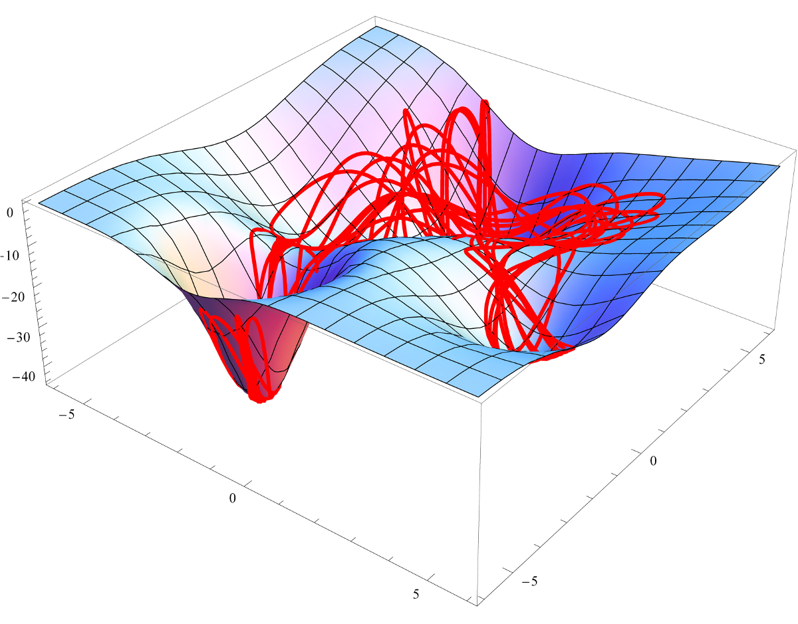

# Shadowing a particle

The purpose of this project was to study the numerical errors in the simulation of trajectory in a system of particles, and their relation to a) uncertainties in the initial conditions of the simulation, b) time-step size of the integration and c) choice of numerical integrator algorithm. 

